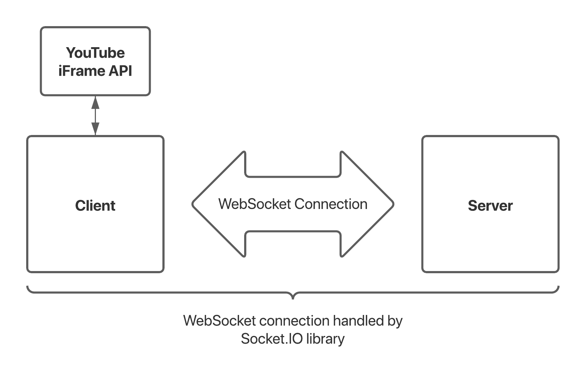

# YouTube Party: A Synchronized Streaming Platform

YouTube full-stack web app that lets any number of users stream YouTube videos
in sync using the Socket.IO library and the YouTube iFrame API.

The client is written in React and server is written in Node.js.

## Architecture Overview

The high-level architecture layout of YouTube Party is as follows:

